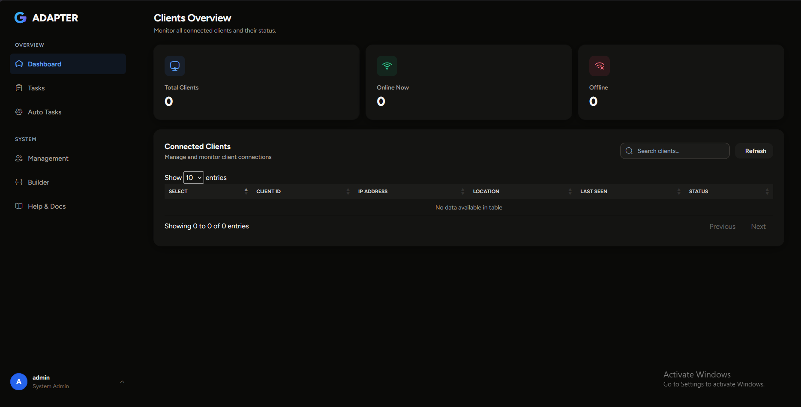
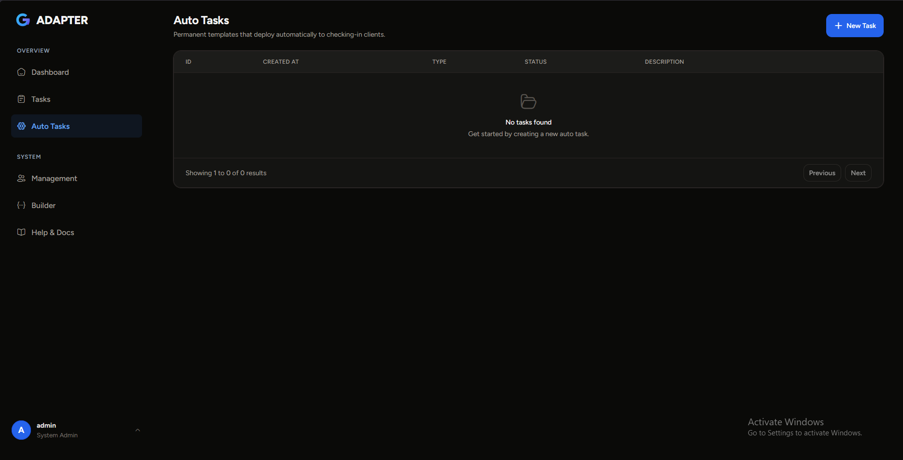
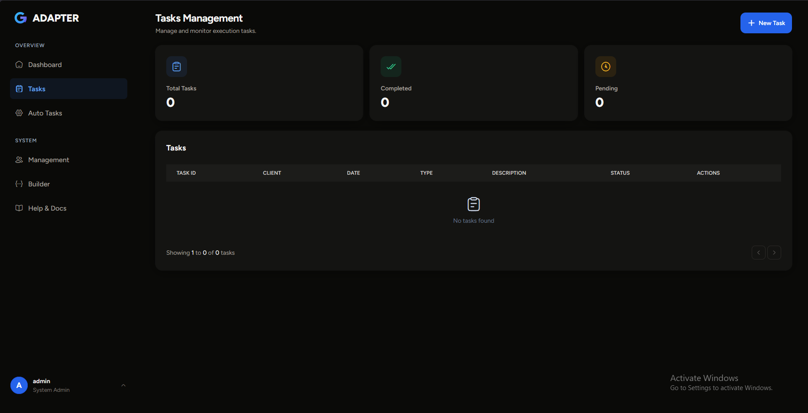

# GAdapter System Management Framework

```text
GAdapter
A lightweight remote administration and systems management framework for authorized endpoints.
```

---

## Overview

**GAdapter** is an open-source remote administration and IT management framework designed for orchestrating and administering systems that you own or have explicit authorization to manage. It provides a secure, centralized interface for system administrators to perform routine maintenance, deploy software updates, execute diagnostics, and monitor system status across multiple managed Windows hosts.

The system is split into two primary components:
1. **Management Server & Web Console**: A Flask-based administration gateway providing a graphical console for system monitoring, task queuing, and endpoint configuration.
2. **Managed Agent Service**: A native Windows service/agent (written in C/C++) or lightweight scripts (PowerShell/Python) that check in with the Management Server, retrieve pending administrative tasks, execute them locally, and return standard execution logs.

---

## Features

GAdapter provides administrative capabilities tailored for secure system orchestration:

* **Secure Control Channel**: Remote command orchestration and agent reporting over TLS/HTTPS with custom protocol decoding.
* **Endpoint Inventory & Status Tracking**: Automatic registration of managed hosts, reporting system hostname, network details, and geographic location.
* **Remote Administrative Sessions**: Support for executing administrative commands and maintenance scripts via PowerShell with stdout/stderr capture.
* **Software & Package Deployment**: Secure remote deployment of administrative executables, updates, or packages to target endpoints.
* **Automated Task Scheduling (Auto Tasks)**: Define policy-based task templates that are automatically assigned and executed on newly registered endpoints.
* **System Diagnostic Utilities**: Low-level diagnostics using native Windows APIs and direct system calls for system state analysis.
* **Deployment Package Generator**: Built-in configuration tool to generate pre-configured deployment packages with customized server addresses, device identifiers, and check-in intervals.
* **Administrative Access Controls**: Session-based user authentication for the console, including support for GitHub OAuth login and role-based access.
* **Secure Gateway Deployment**: Production-ready Gevent WSGI server supporting automatic, localized SSL/TLS certificate generation.

---

## Architecture

GAdapter uses a centralized hub-and-spoke model. The Web Console acts as the administrative portal, the Management Server acts as the REST API gateway, and the Managed Agents poll for scheduled policies.

```text
            Administrative Console (Web Console)
                             │
                             ▼
               Management Server (API Gateway)
                             │
        ┌────────────────────┴────────────────────┐
        ▼                                         ▼
  Managed Agent                             Managed Agent
(C/C++ Native Service)                 (PowerShell/Python Script)
```

---

## Technology Stack

### Management Server & Console
* **Core Framework**: Python 3.8+ & Flask
* **Database & ORM**: SQLAlchemy (defaulting to SQLite, supports PostgreSQL/MySQL)
* **User Sessions**: Flask-Login (session-based authentication) & WTForms
* **OAuth Login**: Flask-Dance (GitHub OAuth support)
* **WSGI Container**: Gevent (with secure SSL/TLS wrapper)
* **Configuration Packaging**: Pyzipper (for secure, password-protected ZIP exports of agents)

### Managed Agent Service
* **Native Agent**: Win32/x64 C/C++ Engine
* **Script Agents**: PowerShell (`.ps1`) & Python (`.py`)
* **Core APIs**: WinHTTP (for gateway communication), Windows API / Direct NT System Calls (for system diagnostics and process management)
* **Data Serialization**: cJSON

---

## Installation

### 1. Clone the Repository
Clone the framework to your system and navigate to the project directory:
```bash
git clone https://github.com/your-username/POADAPTER.git
cd POADAPTER
```

### 2. Configure the Management Server
Navigate to the `Dashboard` directory:
```bash
cd Dashboard
```

Install the Python dependencies:
```bash
pip install -r requirements.txt
```

### 3. Compile the Native Agent 
To build the native Windows C/C++ agent from source:
1. Open Visual Studio.
2. Load the solution file: `Agent/FinalStub.sln`.
3. Select your target configuration (e.g., `Release` / `x64`).
4. Build the solution. The compiled agent binary will be generated under the `Agent/x64/Release/` directory.
*(Note: A pre-compiled agent engine can be placed in `Dashboard/apps/home/master/stub/FinalStub.exe` for the web console's deployment generator).*

---

## Configuration

### Gateway & Server Configuration
The Management Server is configured via environment variables or by editing the configuration dict in `Dashboard/apps/config.py`.

Key settings include:
* `SECRET_KEY`: Flask session secret key (automatically generated if not specified).
* `DB_ENGINE`: The database system to use (e.g., `postgresql` or `mysql`). Defaults to local SQLite if not configured.
* `DB_USERNAME` / `DB_PASS` / `DB_HOST` / `DB_PORT` / `DB_NAME`: Database server credentials.
* `GITHUB_ID` / `GITHUB_SECRET`: Credentials to enable GitHub OAuth login.

### Agent Connection Parameters
The Managed Agent polls the server for administrative directives. Basic settings (such as the target gateway's URL, the unique endpoint identifier, and the check-in frequency) are patched into the agent binary or script using the **Deployment Package Generator** within the Web Console.

---

## Running

### Starting the Management Gateway

#### Development & Testing
To run the server locally on HTTP (port 3000) for debugging:
```bash
python runLocal.py
```
Access the console at `http://localhost:3000`.

#### Production Mode
To run the server in a secure production WSGI container on HTTPS (port 443):
```bash
python runWeb.py
```
*Note: If no SSL certificate (`certificate.crt`) or key (`private.key`) is found in the root directory, the server will automatically generate self-signed SSL credentials.*

### Deploying the Agent Service
Once the deployment package has been generated and configured with the gateway's address:
1. Deploy the compiled executable (`.exe`), script (`.ps1`), or Python script (`.py`) to the target endpoint.
2. Execute the agent service on the target machine. It will register its host details and begin checking in with the Management gateway.

---

## Project Structure

```text
POADAPTER/
├── Agent/                       # Native C/C++ Windows Agent Service
│   ├── include/                 # Header files (Defines.h, cJSON.h)
│   ├── src/                     # C source files (Entry.c, ProCess.c, DataINT.c)
│   ├── Sample.vcxproj           # VS Project definition
│   └── FinalStub.sln            # VS Solution file
│
├── Dashboard/                   # Management Server and Web Console
│   ├── apps/                    # Core Flask app structure
│   │   ├── authentication/      # User accounts & login routing
│   │   ├── home/                # Main controller routes & agent endpoints
│   │   │   ├── master/          # Deployment generator utilities & base binaries
│   │   │   └── routes.py        # API routing for agents and console
│   │   ├── static/              # Console assets, stylesheets, and JS
│   │   └── templates/           # Flask HTML templates
│   ├── runLocal.py              # Launch script (local HTTP)
│   ├── runWeb.py                # Launch script (production HTTPS)
│   └── requirements.txt         # Python dependencies
│
└── Screens/                     # Console UI screenshots
```

---

## Security & Compliance

* **Transport Encryption**: Supports HTTPS control channels to protect system telemetry and administrative commands.
* **Authentication Controls**: Access to the Management Console requires authentication.
* **Secure Distribution**: Generated agent configuration files are packed in password-protected ZIP archives using AES-256 compression to prevent unauthorized configuration access.
* **ORM Database Safety**: SQL operations are parameterized via SQLAlchemy ORM to prevent SQL injection.
* **Cookie Protections**: Session cookies are configured with `HTTPOnly` and `Secure` attributes in production modes.

---

## Intended Use

> [!IMPORTANT]
> **GAdapter is designed solely for authorized system management, IT maintenance, and administrative monitoring.**
>
> Unauthorized remote access, deployment, or system monitoring without the owner's express written consent is prohibited and constitutes a violation of federal and local laws. System administrators are responsible for ensuring compliance with all local security policies.

---

## Limitations & Auditing

* **No Evasion Mechanisms**: GAdapter contains no stealth, anti-auditing, or AV bypass capabilities. The agent runs as a standard user process or service and is fully visible to endpoint auditing and administrative logs.
* **Audit Logs**: The management server records connection logs to `get.log` and `post.log`, providing an audit trail of agent checks and command responses.
* **Manual Setup**: The agent service does not install itself automatically or perform unauthorized privilege escalations; it must be explicitly configured and installed by an authorized system administrator.

---

## Roadmap

* **Central Web Console Enhancements**: Real-time dashboards with performance charts for host RAM, CPU, and disk usage.
* **Multi-Platform Support**: Development of native Linux and macOS agent services.
* **Granular Role-Based Access Control**: Separate read-only operator accounts from command-execution administrators.
* **Real-time WebSockets Integration**: Transition endpoint communication from HTTP polling to WebSockets for real-time control.
* **Expanded Management Tooling**: Integrated service managers, registry editors, and hardware inventory lists.

---

## Screenshots

### Web Console Dashboard


### Automated Task Rules


### Task Log & Execution Audits


---

## Contributing

1. Fork the repository.
2. Create a feature branch (`git checkout -b feature/NewFeature`).
3. Commit your changes (`git commit -m 'Add NewFeature'`).
4. Push to the branch (`git push origin feature/NewFeature`).
5. Open a Pull Request.

---

## License

This project is licensed under the MIT License - see the [LICENSE.txt](file:///d:/Past/2025/Projects/Panels/POADAPTER/POADAPTER/Agent/LICENSE.txt) file for details.

---

## Acknowledgements

* **AppSeed**: Dashboard structure inspiration and boilerplate layouts.
* **cJSON**: Ultra-lightweight JSON parser in ANSI C.
* **pyzipper**: AES encryption support for ZIP files in Python.
